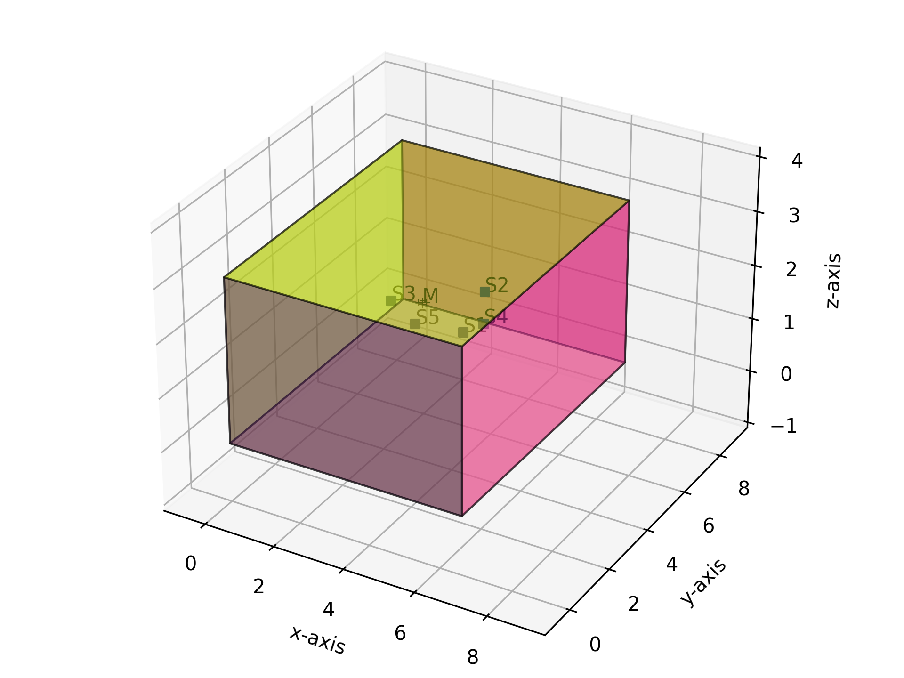
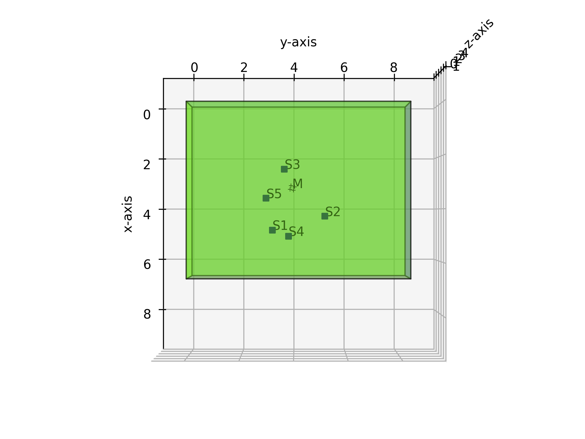

# M2M-TSE using direction and timestamp clues

### __Dayun Choi__ and __Jung-Woo Choi__*

This repository provides the codes for the "__Multichannel-to-Multichannel Target Sound Extraction Using Direction and Timestamp Clues__", presented at ICASSP 2025.

## Abstract

*We propose a multichannel-to-multichannel target sound extraction (M2M-TSE) framework for separating multichannel target signals from a multichannel mixture of sound sources. Target sound extraction (TSE) isolates a specific target signal using user-provided clues, typically focusing on single-channel extraction with class labels or temporal activation maps. However, to preserve and utilize spatial information in multichannel audio signals, it is essential to extract multichannel signals of a target sound source. Moreover, the clue for extraction can also include spatial or temporal cues like direction-of-arrival (DoA) or timestamps of source activation. To address these challenges, we present an M2M framework that extracts a multichannel sound signal based on spatio-temporal clues. We demonstrate that our transformer-based architecture can successively accomplish the M2M-TSE task for multichannel signals synthesized from audio signals of diverse classes in different room environments. Furthermore, we show that the multichannel extraction task introduces sufficient inductive bias in the DNN, allowing it to directly handle DoA clues without utilizing hand-crafted spatial features.*

## Model architecture

Model architecture for M2M-TSE based on direction and timestamp clues.

## Dataset

1. Follow the dataset preparation steps described at [Waveformer](https://github.com/vb000/Waveformer). Once the required files are generated, place them in `dataset/FSD2018_TAU2019`.

2. Download the [REVERB challenge](https://ieeexplore.ieee.org/document/6701894) dataset. Then save the 4-channel noise data obtained by selecting channels 0, 2, 4, and 6 from the original 8-channel recordings into `dataset/REVERB_4ch`. You may refer to `dataset/change_REVERB_channel.py` for details.

3. Go to the `dataset` directory:

        cd dataset

4. Generate the 4-channel reverberant RIRs and update the JAMS files accordingly (e.g., RIR directory paths and source directions). Option 0 generates the dataset without noise, while Option 1 adds REVERB noise. If you fail to download the REVERB challenge dataset, you can proceed only with Option 0. __Option 1 must be run after completing Option 0.__
        
        python spatialize_data.py --option 0
        python spatialize_data.py --option 1

After the above steps, your `dataset` directory should be structured as follows:

    dataset/
    ├── FSD2018_TAU2019/
    │   ├── FSDKaggle2018/
    │   ├── FSDSoundScapes/
    │   ├── download.py
    │   └── fsd_scaper_source_gen.py
    ├── REVERB/
    ├── REVERB_4ch/
    ├── FSDSoundScapes_MC_same_height_8k/
    │   ├── background/zero.wav
    │   ├── FSDKaggle2018/
    │   └── jams/
    ├── FSDSoundScapes_MC_same_height_8k_noise/
    │   ├── FSDKaggle2018/
    │   └── jams/
    ├── jams_RIRs_same_height_8k/
    ├── change_REVERB_channel.py
    ├── pyroom.cfg
    ├── spatialize_data.py
    └── utils.py

The figures below illustrate the room configuration example. (`M` denotes the 4-channel microphone array, and `S*` indicates each individual source.) The details of this example are in `assets/RIR_test_00000000_reverb.txt`.

  

    
    
3D view

  

  

    
    
Top view

  

## Training & Evaluation

Go to the `M2M-TSE` directory:

    cd M2M-TSE

### Training

    python3 -W ignore -m src.training.train experiments/{experiment directory with config.json} --use_cuda --gpu_ids {list of GPU ids used for training, e.g., 0 1 2 3}

### Evaluation

    python3 -W ignore -m src.training.eval experiments/{experiment directory with config.json} --use_cuda --gpu_ids {list of GPU ids used for evaluation, e.g., 0 1 2 3}

## Note

Some components of this repository are based on and modified from:
- Dataset & dataloader: [Pyroomacoustics](https://github.com/LCAV/pyroomacoustics) / [Scaper](https://github.com/justinsalamon/scaper) / [Pyloudnorm](https://github.com/csteinmetz1/pyloudnorm)
- Overall framework of training & evaluation: [Waveformer](https://github.com/vb000/Waveformer)
- Model architecture: [DeFTAN-II](https://github.com/donghoney0416/DeFTAN-II)

Since the [Scaper](https://github.com/justinsalamon/scaper) library is licensed under the BSD-3-Clause License, please make sure to include the original license text in your distribution. For details, see the `THIRD_PARTY_LICENSES` file. For this repository and others, you can see the `LICENSE` file.

## Citation

    @inproceedings{choi2025multichannel,
        title={Multichannel-to-Multichannel Target Sound Extraction Using Direction and Timestamp Clues},
        author={Choi, Dayun and Choi, Jung-Woo},
        booktitle={Proceedings of the 2025 IEEE International Conference on Acoustics, Speech, and Signal Processing (ICASSP)},
        pages={1--5},
        year={2025},
        month={April},
        organization={IEEE},
        address="Hyderabad, India"
    }
